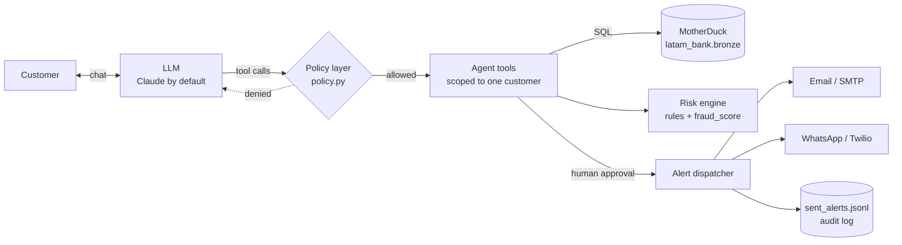
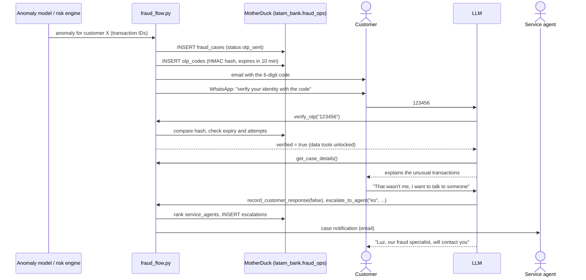
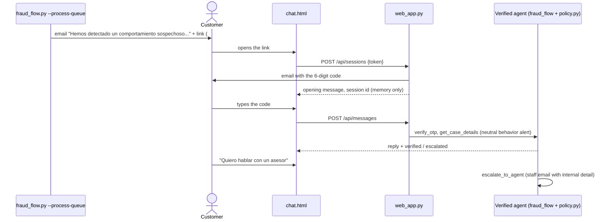

# LATAM Bank Card Support Agent

An AI-first customer-service agent for **card support**: it reviews a customer's card activity,
explains suspicious or unrecognized charges, alerts the customer and hands the case to a human
when needed. Built for the **Factored AI & Data Hackathon 2026** on top of the synthetic
LATAM Bank dataset.

- **Workflow:** Card Support, one of the four workflows proposed by the challenge. Account
  inquiries, transaction disputes and credit products are out of scope: the agent abstains and
  offers a human instead.
- **Data:** MotherDuck (`latam_bank` database, `bronze` layer)
- **LLM:** Claude (Anthropic API) by default; local models via Ollama or Google Gemini as alternatives
- **Channels:** web chat (prototype), WhatsApp (Twilio) and email (SMTP)

The agent talks to a customer whose identity is verified with a one-time code, reviews their card
transactions, explains why a transaction looks risky, and, with the customer's agreement and a
human operator's approval, sends an alert or escalates to a service agent.

> **Status.** Card actions (lock, unlock, report lost or stolen) and Portuguese templates are not
> implemented yet. See [Limitations](#limitations).

**Try the demo:** open `<service URL>/demo` (see [Public demo](#public-demo-for-judges)). It opens a
case for a customer flagged by the model on the synthetic dataset, shows the one-time code on
screen and contacts nobody.

---

## Table of contents

1. [Architecture](#architecture)
2. [How risk is scored](#how-risk-is-scored)
3. [Agent tools](#agent-tools)
4. [Safety controls](#safety-controls)
5. [Verified WhatsApp flow](#verified-whatsapp-flow-fraud_flowpy)
6. [Setup](#setup)
7. [Configuration reference](#configuration-reference)
8. [Usage](#usage)
9. [Setting up real alerts](#setting-up-real-alerts)
10. [Evaluation](#evaluation)
11. [Customer clustering model](#customer-clustering-model)
12. [Tests](#tests)
13. [Deployment](#deployment)
14. [Audit log](#audit-log)
15. [Column mapping](#column-mapping)
16. [Limitations](#limitations)
17. [Project structure](#project-structure)
18. [Troubleshooting](#troubleshooting)

---

## Architecture



Key design choices:

- **The LLM never decides the risk.** The score is computed by deterministic, explainable code.
  The model only chooses which tool to call and explains the results in the customer's language.
- **The LLM never decides what it is allowed to do.** Every tool call goes through `policy.py`,
  which checks the tool's permissions in code before it runs (see [Safety controls](#safety-controls)).

### Typical conversation


---

## How risk is scored

Each transaction is compared **only against the customer's earlier history**, so the engine
never "looks into the future".

| # | Rule | Points | Condition |
|---|------|-------:|-----------|
| 1 | Atypical amount | +40 | `amount_usd` ≥ 3 standard deviations above the customer's mean **and** more than 2× the mean |
| 2 | New country | +30 | First transaction ever in that `transaction_country` |
| 2b | New city | +15 | First transaction in that `transaction_city` (only if the country is not new) |
| 3 | New category | +10 | New merchant category with an amount above the customer's median |
| 4 | Unusual hour | +15 | Between 00:00 and 05:00 for a customer with < 5% night-time activity |
| 5 | Burst | +25 | 3 or more transactions within 10 minutes |
| 6 | Consecutive declines | +20 | 2 or more `Declined` attempts right before (card-testing pattern) |
| 7 | Impossible travel | +35 | Two in-person transactions (ATM, Branch, POS) ≥ 300 km apart at a speed above 900 km/h |

Rules 1 to 4 need at least 5 prior transactions. Rules 4 to 6 only run when timestamps
include a time of day. Rule 7 uses `latitude` / `longitude` and skips digital channels
(Web, App, Transfer), where coordinates do not prove the card's location.

Amounts are compared in **USD** (`amount_usd`), so customers who transact in several currencies
(MXN, COP, ARS, USD) are scored consistently. Alerts still show the local amount and currency.

**Final score** = `max(rule score, bank fraud_score)`, on a 0 to 100 scale.
`fraud_score` is normalized automatically (values in 0-1 are multiplied by 100).

| Score | Level |
|------:|-------|
| ≥ 60 | high |
| 30 to 59 | medium (suspicious) |
| < 30 | low |

> `is_fraud` is **never** used to score. It is the ground-truth label and is reserved for
> [evaluation](#evaluation). Using it as a signal would be data leakage.

All thresholds and weights are constants at the top of `fraud_agent.py`
(`SUSPICIOUS_THRESHOLD`, `HIGH_RISK_THRESHOLD`, `MIN_HISTORY`, `BURST_WINDOW_MIN`, `AMOUNT_ZSCORE`).

---

## Agent tools

The model can call these five functions in the console chat (`fraud_agent.py`). None of them
takes a customer ID: they are bound to the customer of the session when the chat starts. Every
tool must be registered in `policy.TOOL_POLICY`; an unregistered tool is rejected at startup.

| Tool | Purpose | Returns |
|------|---------|---------|
| `view_customer_profile()` | Basic profile | Name, country, segment, status, **masked** email and phone |
| `list_transactions(days, limit)` | Recent activity | Newest-first transactions, without risk data |
| `assess_fraud_risk(days)` | Risk assessment | Suspicious transactions with score, level, reasons and card (e.g. `Credit Card ****1234`) |
| `send_fraud_alert(transaction_ids, channel, message)` | Alert the customer | Delivery result per channel |
| `escalate_to_agent(conversation_language, reason, summary, transaction_ids)` | Hand off to a human | Assigned agent and routing explanation |

`days` is counted back from the customer's **last recorded transaction**, not from today,
because the dataset is historical (it ends in June 2026).

The default window is **180 days**. The dataset has ~5M transactions for 150k customers over
3 years, about 33 per customer (one or two a month), so a 30-day window usually holds a single
transaction and gives the rules nothing to compare.

### Language model: Claude, local (Ollama) or Gemini

`LLM_PROVIDER` chooses the model behind the agent. Everything else (tools, OTP gate, routing,
tables) is identical, because both providers expose the same small interface
(`create_llm_session` in `fraud_agent.py`).

| | `anthropic` (default) | `ollama` | `gemini` |
|---|---|---|---|
| Runs | Claude API | On your machine | Google API |
| Quota / cost | Pay per use (API credits) | None | Free tier: ~20 requests per day per model; paid beyond |
| Internet | Required | Not needed for the model | Required |
| Quality | Highest | Good with 4B models; slower on CPU | High |
| Data | Sent to Anthropic | Never leaves the machine | Sent to Google |

With Claude, `AnthropicChat` runs the tool-use loop of the Messages API: while the response's
`stop_reason` is `tool_use`, each requested tool runs and its `tool_result` goes back to the model.
Overload (529) is retried and then falls back along `ANTHROPIC_FALLBACK_MODELS`.

With Ollama, the tool-calling loop is implemented in `OllamaChat`: tool schemas are generated
from each function's type hints and docstring, arguments are coerced (small models often send
`"30"` for an integer), reasoning is off by default (`OLLAMA_THINK=0`) for speed, and models
without reasoning support are retried automatically. `OLLAMA_FALLBACK_MODELS` works like the
Gemini fallback chain; a missing model (404) prints the `ollama pull` command to fix it.

Setup: install Ollama (ollama.com/download), then `ollama pull qwen3.5:4b` and
`ollama pull gemma4:e4b`.

### Resilience

- **Retries:** overload errors from Gemini (500, 503, 504) are retried 3 times with exponential
  backoff (2, 4 and 8 seconds).
- **Quota errors are not retried:** a 429 (quota exhausted, e.g. the free tier's daily limit per
  model) switches immediately to the next model, since waiting seconds would not help.
- **Fallback chain:** `GEMINI_FALLBACK_MODELS` lists models to try in order, keeping the
  conversation history. Each model has its own free-tier quota.
- **Idempotent tools:** a retried LLM turn re-runs its tool calls, so tools with side effects
  (verify OTP, resend OTP, escalate) never repeat or undo their effect within a session.
- **Tool-call cap:** at most 5 tool calls per customer message, and the system prompt asks the
  model to call each tool once and offer a longer window instead of widening it on its own.

---

## Safety controls

| Control | What it prevents |
|---------|------------------|
| Behavior alerts built from an allow-list (`src/models/behavior_alerts.py`) | The LLM revealing that the customer is profiled by segment, or any internal metric of the clustering model |
| Permission table in code (`policy.py`) | The LLM running a data tool before identity is verified; tools not in the table never run |
| Tools scoped to the session's customer | A prompt injection cannot make the agent read another customer's data |
| Risk computed in code, not by the LLM | Invented or inconsistent risk levels |
| `send_fraud_alert` only accepts IDs flagged by the last `assess_fraud_risk` | Alerts about arbitrary transactions |
| Human approval (`CONFIRM_SENDS=1`) | Any message leaving the system without review |
| Demo mode (`DEMO_MODE=1`) | Messages reaching the contact data in the dataset |
| Masked contact data | Exposing full emails or phone numbers to the LLM |
| Anti-phishing footer in every alert | Customers being trained to share credentials |
| Append-only audit log | Untraceable alerts |
| Deduplication by `transaction_id` | Double-counting the ~2% duplicates in the bronze layer |

---

## Verified WhatsApp flow (`fraud_flow.py`)

The end-to-end customer journey: an anomaly opens a case, the customer proves their identity
with a one-time code, and only then does the agent discuss the case and, if needed, hand it to
a human agent who speaks the customer's language.



### Commands

| Command | What it does |
|---------|--------------|
| `python fraud_flow.py --setup` | Creates `anomaly_queue`, `fraud_cases`, `otp_codes` and `escalations` in `fraud_ops` |
| `python fraud_flow.py --trigger CUSTOMER_ID` | Opens a case for one flagged customer, sends the OTP and opens the WhatsApp simulator in the console |
| `python fraud_flow.py --trigger ID1 ID2 ID3` | Batch: one case per customer flagged by the anomaly model (no console chat) |
| `python fraud_flow.py --from-file anomalies.csv` | Batch from a CSV (`customer_id`, optional `anomaly_score`) or a TXT with one ID per line |
| `python fraud_flow.py --process-queue` | Batch from the `fraud_ops.anomaly_queue` table (pending rows) |
| `python fraud_flow.py --trigger CUSTOMER_ID --tx TX1 TX2` | One customer, with specific transactions |
| `python fraud_flow.py --chat CASE_ID` | Resumes a case in the console (a new code can be requested) |
| `python fraud_flow.py --route CUSTOMER_ID --language es` | Shows the top 5 agents and why they were ranked |
| `python fraud_flow.py --whatsapp-server` | Runs the Twilio webhook for real WhatsApp conversations |

### Connecting the anomaly model

The model only needs to output **anomalous `customer_id`s**. Three ways to hand them over:

1. **Queue table (recommended):** the model inserts rows into `fraud_ops.anomaly_queue`, and
   `--process-queue` opens the cases and marks each row as processed.

   ```sql
   INSERT INTO latam_bank.fraud_ops.anomaly_queue (customer_id, detected_at, model_name, anomaly_score)
   VALUES ('CLI-G4X2AMVD62NR', now(), 'isolation_forest_v1', 0.93);
   ```

2. **File:** export a CSV with a `customer_id` column (see `anomalies.example.csv`) and run
   `--from-file`.
3. **Python:** `fraud_flow.open_cases_for_customers(["CLI-...", ...], scores={...})`.

For each customer:

| Situation | Behavior |
|-----------|----------|
| Customer does not exist | Skipped (`not_found` in the queue) |
| Customer already has a case in progress | No new case and **no second OTP** (`duplicate`) |
| Rules also find suspicious transactions | Those transactions are shown, with their reasons |
| Rules find nothing | The case is still opened (the model flagged the customer) and the top 3 transactions of the window are shown. The agent says the model noticed an unusual pattern and asks the customer to review them, without calling any single one fraud |

Every case records `source = anomaly_model` and the model's `anomaly_score`.

In demo mode every WhatsApp goes to the same test number, so after a batch, talk to a specific
case with `--chat CASE_ID`.

### Tables written to `latam_bank`

`fraud_flow.py` needs a MotherDuck token with **write** access. Tables are created on the first
run (or with `--setup`) in the `fraud_ops` schema, separate from the source `bronze` data.

| Table | Key columns | Purpose |
|-------|-------------|---------|
| `anomaly_queue` | `customer_id`, `detected_at`, `model_name`, `anomaly_score`, `processed_at`, `case_id`, `result` | Input from the anomaly model; rows with `processed_at` NULL are pending |
| `fraud_cases` | `case_id`, `customer_id`, `source`, `anomaly_score`, `transaction_ids`, `max_score`, `reasons`, `status`, `customer_comment` | One row per anomaly case and its lifecycle |
| `otp_codes` | `otp_id`, `case_id`, `code_hash`, `expires_at`, `attempts`, `status` | One-time codes (hashed) and verification state |
| `escalations` | `escalation_id`, `case_id`, `agent_id`, `language`, `routing_score`, `routing_reasons`, `status` | Hand-offs to human agents, with the routing explanation |

Case status: `otp_sent` → `verified` → `customer_confirmed_legit` / `customer_reported_fraud` → `escalated`.

### OTP security

| Control | Detail |
|---------|--------|
| Secure generation | 6 digits from Python's `secrets` module |
| Never stored in plain text | `code_hash = HMAC-SHA256(OTP_SECRET, otp_id + code)`; a database leak does not reveal codes |
| Expiry | 10 minutes (`OTP_TTL_MIN`) |
| Attempt limit | 3 wrong attempts lock the code |
| Resend limit | At most 3 codes per case |
| One active code | Requesting a new code invalidates the previous one (`superseded`) |
| Enforced in code | Until `verify_otp` succeeds, every data tool returns an error, whatever the LLM tries (`policy.enforce`) |
| Not logged | The console shows `verify_otp(******)` |
| Anti-phishing opener | The first WhatsApp message reveals no account data and states the bank never asks for passwords |

In demo mode without SMTP, the code is printed in the console (`[demo] correo simulado; código
OTP = ...`) so the flow can be tested end to end.

### Agent routing

Agents come from `bronze.service_agents` (deduplicated by `agent_id`).

**Hard filters** (an agent who fails any of them is never chosen):

| Filter | Rule |
|--------|------|
| Language | `languages` must include the language of **this conversation**. A Spanish conversation is never routed to an English-only agent |
| Status | `agent_status = 'Active'` (no Vacation, Leave or Inactive) |
| Channel | `agent_type` is not `In-Person`, since the conversation is a chat |

**Soft score** (higher is better):

| Criterion | Points |
|-----------|-------:|
| `specialty` = Fraudes | +40 |
| `native_accent` = customer's `detected_accent` | +20 |
| `country_of_origin` = customer's `country` | +15 |
| On shift now (`work_shift`: Morning 06-14, Afternoon 14-22, Night 22-06, Rotating always) | +15 |
| `agent_type` Digital or Hybrid | +10 |
| `experience_level`: Specialist / Senior / Mid-Senior / Junior | +10 / +7 / +4 / 0 |
| `avg_csat` (1-5; missing = 3.5) | × 3 |
| `total_monthly_interactions` (workload) | − value / 100 |

If no active agent speaks the language, the escalation is stored as `pending_no_agent` and the
customer is told a person will contact them.

Example (`--route CLI-G4X2AMVD62NR --language es`):

```text
  117.5  AGT-...  Luz Rojas | español | Fraudes | Digital | Rotating
        habla español; especialista en fraudes; mismo acento (colombian); mismo país (Colombia); en turno (Rotating); atiende chat (Digital)
```

### Demo recipients and channel switches

In demo mode (`DEMO_MODE=1`) nothing is sent to the dataset's contact data. Recipients are chosen
by priority:

| Priority | Source | Example |
|---------:|--------|---------|
| 1 | Command line (one customer) | `python fraud_flow.py --trigger CLI-... --email me@gmail.com --whatsapp +573001234567` |
| 2 | `demo_recipients.csv`, one row per customer | `CLI-BBYM7NYP9LUO,teammate@gmail.com,+573004445566` |
| 3 | `TEST_ALERT_EMAIL` / `TEST_ALERT_WHATSAPP` | Default for everyone else |

With a different WhatsApp number per customer, several teammates can each run a case at the same
time: the webhook matches every incoming message to the open case of that phone number. Copy
`demo_recipients.example.csv` to `demo_recipients.csv` (it is in `.gitignore`). Every number must
have joined the Twilio sandbox.

Channel switches, independent from the credentials:

| Variable | Effect |
|----------|--------|
| `EMAIL_ENABLED=0` | No email is sent (`disabled`); the OTP is still shown in the console |
| `WHATSAPP_ENABLED=0` | No WhatsApp is sent; use the console simulator |
| `SHOW_OTP_IN_CONSOLE=0` | Hide the OTP in the console even in demo mode (it is never shown in real mode) |

At startup both scripts print the delivery status, for example:
`Modo DEMO | correo: activo | WhatsApp: desactivado | 2 destinos por cliente en demo_recipients.csv`.

### WhatsApp templates (Twilio error 21654)

Some Twilio WhatsApp senders (for example the trial sender assigned by the new Console) only accept
**approved Content Templates** for business-initiated messages and reject free text with error
21654. In that case the case opener must be sent as a template:

1. In the Twilio Console, open the **Content Template Builder**, create a text template and submit
   it for WhatsApp approval, or use a pre-approved sample if your sender offers one. Example body:
   `Hola {{1}}, te escribe LATAM Bank. Detectamos actividad inusual. Escribe aquí el código de 6 dígitos que enviamos a {{2}}.`
2. Copy its SID (starts with `HX`) and map the slots in `.env`:

   ```
   TWILIO_CONTENT_SID=HXxxxxxxxxxxxxxxxxxxxxxxxxxxxxxxxx
   TWILIO_CONTENT_VARIABLES={"1": "{first_name}", "2": "{email}"}
   ```

   Available fields: `first_name`, `email` (masked), `case_id`, `bank`.
3. Check it with `python fraud_flow.py --test-whatsapp +57...`,
   which sends a test opener and prints Twilio's exact answer without touching the database.

Only the opener uses the template. Replies inside the conversation are free text, which WhatsApp
allows during the 24-hour window that starts when the customer writes.

### Real WhatsApp (Twilio webhook)

The console simulator is enough for the demo. To use a real phone:

1. Configure the Twilio WhatsApp Sandbox (see [Setting up real alerts](#setting-up-real-alerts))
   and join it from your phone.
2. Start the webhook: `python fraud_flow.py --whatsapp-server` (port 8080).
3. Expose it with a tunnel, for example `ngrok http 8080`.
4. In the Twilio sandbox settings, set **When a message comes in** to
   `https://<your-ngrok-domain>/whatsapp` (method POST).
5. Set `PUBLIC_URL=https://<your-ngrok-domain>` in `.env` so the server validates Twilio's
   request signature and rejects forged requests.
6. Open a case with `--trigger <customer> --no-chat`. The OTP arrives by email and the opener by
   WhatsApp; reply from your phone.

The server answers Twilio immediately and sends the reply through the REST API, because an LLM
turn with tools can exceed Twilio's 15-second webhook timeout. Incoming messages are matched to
the most recent open case of that phone number.

---

## Setup

### Requirements

- Python 3.10+
- A MotherDuck account with the `latam_bank` database loaded
- An Anthropic API key ([Claude Console](https://console.anthropic.com/)), or Ollama / a Gemini
  API key if you change `LLM_PROVIDER`
- Optional: Gmail account and/or Twilio account for real alerts

### Install

```bash
git clone https://github.com/algirldos/factored-hackathon-2026--TM-.git
cd factored-hackathon-2026--TM-

python -m venv .venv
# Windows
.venv\Scripts\python -m pip install -r requirements-dev.txt
# Linux / macOS
.venv/bin/pip install -r requirements-dev.txt
```

`requirements-dev.txt` installs `requirements.txt` plus `pytest`. Use `requirements.txt` alone
on a server that does not run the tests.

### Configure

```bash
cp .env.example .env      # Windows: copy .env.example .env
```

Fill in at least `MOTHERDUCK_TOKEN` and `ANTHROPIC_API_KEY` (plus `OTP_SECRET` for the
verified flow). The scripts load `.env` automatically. Never commit `.env`: it is in `.gitignore`.

### First run

```bash
python fraud_agent.py --columns          # check the column mapping
python fraud_agent.py --demo-customers   # pick customers for the demo
python fraud_agent.py --customer <ID>    # start the chat
```

---

## Configuration reference

| Variable | Required | Default | Description |
|----------|:--------:|---------|-------------|
| `MOTHERDUCK_TOKEN` | yes | | MotherDuck access token (a read-only token is recommended) |
| `MOTHERDUCK_DB` | | `latam_bank` | Database name |
| `TRANSACTIONS_TABLE` | | `bronze.transactions` | Transactions table |
| `CUSTOMERS_TABLE` | | `bronze.customers` | Customers table |
| `PRODUCTS_TABLE` | | `bronze.products` | Products table (card type and last 4 digits for alerts) |
| `LLM_PROVIDER` | | `anthropic` | `anthropic` (Claude), `ollama` (local models) or `gemini` |
| `ANTHROPIC_API_KEY` | anthropic | | Claude API key |
| `ANTHROPIC_MODEL` | | `claude-sonnet-5-5` | Claude model |
| `ANTHROPIC_FALLBACK_MODELS` | | `claude-haiku-4-5-20251001` | Comma-separated fallback chain |
| `OLLAMA_MODEL` | | `qwen3.5:4b` | Local model (must support tools) |
| `OLLAMA_FALLBACK_MODELS` | | `gemma4:e4b` | Comma-separated local fallback chain |
| `OLLAMA_NUM_CTX` / `OLLAMA_NUM_PREDICT` | | `8192` / `1024` | Context window and max tokens per answer |
| `OLLAMA_THINK` | | `0` | `1` enables reasoning (better, slower) |
| `GEMINI_API_KEY` | gemini | | Gemini API key (only with `LLM_PROVIDER=gemini`) |
| `GEMINI_MODEL` | | `gemini-3.8-flash` | Primary model |
| `GEMINI_FALLBACK_MODELS` | | `gemini-3.5-flash` | Comma-separated fallback chain, used if the primary model is overloaded or out of quota |
| `DEMO_MODE` | | `1` | `1`: alerts go only to the test recipients. `0`: to the customer's real contacts |
| `CONFIRM_SENDS` | | `1` | `1`: a human must approve each alert in the console |
| `EMAIL_ENABLED`, `WHATSAPP_ENABLED` | | `1` | Turn a delivery channel on or off |
| `DEMO_RECIPIENTS_FILE` | | `demo_recipients.csv` | Optional CSV with a demo recipient per customer |
| `SHOW_OTP_IN_CONSOLE` | | `1` | Print the OTP in the console (demo mode only) |
| `TEST_ALERT_EMAIL` | | | Email recipient in demo mode |
| `TEST_ALERT_WHATSAPP` | | | WhatsApp recipient in demo mode, E.164 format (`+57...`) |
| `SMTP_HOST`, `SMTP_PORT` | | `587` | SMTP server |
| `SMTP_USER`, `SMTP_PASSWORD` | | | SMTP credentials (for Gmail, an App Password) |
| `SMTP_FROM` | | `SMTP_USER` | Sender address |
| `TWILIO_ACCOUNT_SID`, `TWILIO_AUTH_TOKEN` | | | Twilio credentials |
| `TWILIO_WHATSAPP_FROM` | | | Twilio WhatsApp sender (the sandbox number while testing) |
| `TWILIO_CONTENT_SID` | | | Approved Content Template (HX...) for the case opener; needed if Twilio answers 21654 |
| `TWILIO_CONTENT_VARIABLES` | | | JSON mapping template slots to fields, e.g. `{"1": "{first_name}", "2": "{email}"}` |
| `OTP_SECRET` | flow | | Server-side secret for hashing OTPs. Use a long random string and never commit it |
| `OTP_TTL_MIN` | | `10` | Minutes an OTP stays valid |
| `FRAUD_OPS_SCHEMA` | | `fraud_ops` | Schema in `latam_bank` for cases, OTPs and escalations |
| `AGENTS_TABLE` | | `bronze.service_agents` | Service agents table used for routing |
| `PUBLIC_URL` | | | Public HTTPS URL of the webhook (ngrok); enables Twilio signature validation |
| `WHATSAPP_SERVER_PORT` | | `8080` | Port of the WhatsApp webhook |
| `PUBLIC_DEMO` | | `0` | `1`: enables `/demo` (codes on screen, nothing sent). Only for the public demo |
| `DEMO_PER_IP_HOUR`, `DEMO_DAILY_LIMIT` | | `5`, `150` | Public demo quotas per visitor per hour and per day |
| `CASE_CHANNEL` | | `web` | `web`: new cases send an email with a link to the web chat. `whatsapp`: OTP by email + WhatsApp opener |
| `PUBLIC_WEB_URL` | | `RENDER_EXTERNAL_URL` or `http://localhost:8000` | Public URL of the web chat, used in the emailed links (HTTPS in production) |
| `LINK_TTL_HOURS` | | `72` | Hours an emailed link stays valid |
| `WEB_IDLE_TIMEOUT_S`, `WEB_MAX_MESSAGES` | | `300`, `40` | Web session idle timeout and messages per session |
| `HOST`, `PORT` | | `127.0.0.1`, `8000` | Address of `web_app.py` |

If the email or WhatsApp settings are missing, alerts are **simulated**: everything runs and is
logged, but nothing is delivered. That is enough for a demo.

---

## Usage

### Command line

| Command | What it does |
|---------|--------------|
| `python fraud_agent.py --customer CUST-000123` | Interactive chat for that customer |
| `python fraud_agent.py --monitor ID1 ID2 ...` | Proactive scan; proposes alerts for high-risk transactions (no LLM) |
| `python fraud_agent.py --demo-customers` | Top customers by fraud signals in the dataset's last 30 days |
| `python fraud_agent.py --evaluate 40` | Precision and recall on a sample of 40 customers |
| `python fraud_agent.py --columns` | Shows how table columns were mapped |

Options: `--days N` (analysis window, default 180) and `--channel email|whatsapp|both`
(for `--monitor`, default `both`).

### Customer web chat (`web_app.py`)

The customer reaches the agent from a link emailed when a case is opened. With
`CASE_CHANNEL=web` (the default), `fraud_flow.py --process-queue` sends that email instead of
the OTP + WhatsApp opener.

```bash
python web_app.py        # serves the chat at PUBLIC_WEB_URL (default http://localhost:8000)
```



The page shows the tool name, a "Tu caso" panel with three steps (verify identity, review
activity, decide what to do), the conversation, quick replies and the message box. After
verification the customer can say whether they recognize the activity, ask what to do, or
hand the case to an advisor with one button.

| Control | Detail |
|---------|--------|
| Link token | 256 random bits, only its SHA-256 is stored (`fraud_ops.case_links`), expires after `LINK_TTL_HOURS` (72), a new link revokes the old one, closed cases do not open |
| Token never in logs | It travels in the URL fragment (`#t=`), which browsers do not send to the server; the page removes it from the address bar right away |
| Identity | The OTP is emailed when the link is opened (so it does not expire unread) and the agent's data tools stay locked until it is verified (`policy.py`) |
| Session | Random id kept in page memory only (no cookies or local storage), idle timeout of 5 minutes on both sides, reopening the link replaces the old session, at most `WEB_MAX_MESSAGES` (40) messages |
| Input | Full card numbers are masked in the page **and** on the server before reaching the agent; messages over 1,000 characters are rejected |
| Page | Strict security headers (CSP, `frame-ancestors 'none'`, `no-referrer`, `no-store`), API docs disabled |

To try it without email, keep `DEMO_MODE=1`: the link and the code are printed in the console
of `fraud_flow.py` and `web_app.py`.

### Example session

```text
Cliente: Hola, vi un cobro raro en mi tarjeta
  [tool] assess_fraud_risk(days=30)

Agente: Revisé tus últimos 30 días y encontré 3 transacciones de riesgo alto el 4 de marzo,
entre las 3:00 y las 3:03 a.m., en Miami: dos intentos rechazados de 900 USD y un cobro
aprobado de 950 USD. Es 12 veces tu gasto promedio, en un país donde nunca habías comprado y
a una hora inusual para ti. ¿Quieres que te envíe una alerta por WhatsApp con el detalle?
```

---

## Setting up real alerts

Keep `DEMO_MODE=1` while testing: alerts will only reach `TEST_ALERT_EMAIL` and
`TEST_ALERT_WHATSAPP`.

### Email (Gmail)

1. Turn on 2-Step Verification in your Google account.
2. Create an **App Password** (Google Account → Security → App passwords).
3. Put the 16-character password in `SMTP_PASSWORD` (not your normal password).

### WhatsApp (Twilio Sandbox)

1. Create a free Twilio account.
2. Go to **Messaging → Try it out → Send a WhatsApp message**.
3. From your phone, send the `join <code>` message shown in the console to the sandbox number.
4. Copy the Account SID, Auth Token and sandbox number into `.env`.

The sandbox only delivers to phones that joined it, which also makes it safe for demos.

---

## Evaluation

```bash
python fraud_agent.py --evaluate 40
```

1. Draws a **balanced sample**: half customers with at least one `is_fraud` transaction, half without.
2. Scores **every** transaction of those customers against their own prior history.
3. Reports precision and recall against `is_fraud` for three signals at two thresholds (30 and 60):
   - `rules`: the explainable rules alone
   - `model`: the bank's `fraud_score` alone
   - `combined`: the final score used by the agent

```text
signal       threshold  alerts  precision   recall
rules               30     ...        ...      ...
model               30     ...        ...      ...
combined            30     ...        ...      ...
```

Because the sample over-represents fraud, **real-world precision will be lower** than reported.
Recall is not affected by the balancing.

### Held-out evaluation of the clustering model

```bash
python evaluate_clusters.py --train-as-of 2026-03-18 \
    --eval-as-of 2026-04-17 2026-05-17 2026-06-17 --rules-negatives 3000
```

Read-only. The model is trained in memory with data up to `--train-as-of` and evaluated on the
30-day windows that end on each `--eval-as-of`, which it never saw. The label is customer-level
(at least one `is_fraud` transaction in the window) and is used only here. Every method is
compared on the same customers: the clustering model, the bank's `fraud_score` (max in the
window), the agent's rules (all positives plus a weighted sample of 3,000 negatives) and a
random ranking. The full report is in `reports/evaluation_20260318.md` and `.json`.

Results on the real data (about 39,000 active customers and 57-59 with fraud per window, a base
rate of 0.15%):

| Method | Average precision (3 windows) | ROC-AUC (3 windows) |
|--------|-------------------------------|---------------------|
| Clustering model | 0.002 - 0.004 | 0.51 - 0.58 |
| Bank `fraud_score` | 0.53 - 0.64 | 0.81 - 0.84 |
| Agent rules | 0.002 | 0.50 - 0.56 |
| Random | 0.002 | 0.44 - 0.54 |

At the default queue threshold (4 of 5 metrics), the clustering model flags 330-354 customers
per window with 0.3-0.6% precision and 2-3% recall; the bank's `fraud_score`, flagging the same
number of customers, reaches 9-11% precision.

**Conclusion.** On this dataset, deviations of spending volume and amounts from the customer's
segment barely separate fraud from normal activity (about random), and the agent's rules do not
either; the bank's `fraud_score` is far stronger. The clustering signal is kept as a behavior
alert, not as a fraud detector, and the evaluation should drive what the queue prioritizes.
The windows are consecutive 30-day periods; one day (2026-05-18) falls between the second and
third window.

---

## Customer clustering model

A second, learned risk signal: customers are grouped by profile with K-means, and a customer's
last 30 days of activity are compared with the usual behavior of their group. Its output is
**per customer and per metric**, not per transaction.

The logic of `notebooks/01_eda.ipynb` (sections 1 and 2) and
`notebooks/03_clustering_refactored.ipynb` now lives in importable modules, so training, batch
scoring and the agent share the same code. The notebooks remain for exploration.

| Module | Notebook origin | What it does |
|--------|-----------------|--------------|
| `src/features/sources.py` | `bank_reader.py` | Reads customers, products, transactions and exchange rates from MotherDuck; filters and deduplicates in SQL |
| `src/features/currency.py` | `01_eda` §1 | Country to currency mapping and the fixed USD rates of `currency_config.json` |
| `src/features/customer_features.py` | `01_eda` §1-2 | One row per eligible customer: balances per product, debt, assets, age |
| `src/models/customer_clustering.py` | `03` §2-10, 21-23 | Preprocessor, PCA and K-means: fit, save, load and assign clusters |
| `src/features/transaction_behavior.py` | `03` §12-18 | Baseline (12 months) and recent (30 days) windows and the behavior metrics |
| `src/models/behavior_scoring.py` | `03` §19-26 | Robust profile per cluster and deviation per metric; a metric is suspicious at ≥ 3 robust standard deviations |

Differences from the notebooks, made so results are reproducible:

- Everything is computed at an explicit `as_of` date: age, windows and exchange rates. The
  notebooks used today's date and the latest timestamp in the data (with its time of day).
- USD amounts use the fixed rates of `src/config/currency_config.json` (a project decision, so
  features do not move with the exchange rate); `sources.load_usd_rates` can read daily rates if
  that decision changes.
- Duplicate rows of the bronze layer are removed (customers and products by `last_updated`,
  transactions by `transaction_id`), so balances and amounts are not counted twice.
- Every product column exists even when scoring a single customer.
- `is_fraud` is no longer a required input: it is the evaluation label only.

### Training

```bash
python train_clusters.py --as-of 2026-05-31
```

Trains the customer model and the cluster profiles with data **up to `--as-of`** (read-only
MotherDuck connection, `MOTHERDUCK_TOKEN` in `.env`) and writes a versioned folder:

```text
models/clusters_20260531/
├── customer_cluster_model.joblib     # preprocessor + PCA + K-means
├── cluster_behavior_profiles.joblib  # robust statistics per cluster (same keys as the notebook)
└── metadata.json                     # what was trained, with which data and libraries
```

| Guarantee | How |
|-----------|-----|
| Same date and data give the same model | Fixed random state, rows sorted by `customer_id`; `metadata.json` stores a fingerprint of the training data to prove it |
| No future data | Customer features and the 12-month profile window end on `--as-of` (USD rates are fixed); a test adds transactions after that date and checks the model does not change |
| Traceable | `metadata.json` records the version, `as_of`, windows, number of customers and transactions, cluster sizes, explained variance, the USD rates used (and their source) and the Python, scikit-learn, pandas and numpy versions |
| Loadable | `load_artifacts` refuses a folder trained with another scikit-learn minor version, with a message that says which one, instead of failing inside joblib |

To evaluate without leakage, train at a date and score a later period (stage 6 of the plan).
Customer and product tables are monthly snapshots without history, so customer attributes
are the latest available, not the ones at `--as-of`.

### Batch scoring

```bash
python score_customers.py --as-of 2026-06-17 --dry-run   # compute and print, write nothing
python score_customers.py --as-of 2026-06-17             # write fraud_ops + enqueue
```

Assigns every eligible customer to a cluster, computes the behavior of the 30 days that end
on `--as-of` and compares it with the profile of the cluster. Only these metrics decide
whether a customer is suspicious (`SUSPICIOUS_FEATURES` in `src/models/behavior_scoring.py`):

| Metric | Meaning |
|--------|---------|
| `num_transacciones_monthly` | Transactions per 30 days |
| `monto_total_usd_monthly` | Amount spent per 30 days (USD) |
| `monto_promedio_usd` | Average transaction amount |
| `monto_mediano_usd` | Median transaction amount |
| `monto_maximo_usd` | Largest transaction |

A metric is suspicious when it is at least 3 robust standard deviations from the cluster's
median. A customer goes to the queue when **`--min-suspicious`** of the 5 metrics are
suspicious (default 4).

Tables written in `fraud_ops` (the token needs write access; `--dry-run` uses a read-only
connection):

| Table | One row per | Content |
|-------|-------------|---------|
| `customer_cluster` | customer | Assigned cluster |
| `behavior_anomalies` | customer and metric | Value, cluster median and p25/p75, deviation, suspicious or not |
| `customer_anomaly` | scored customer | Mean deviation, number and list of suspicious metrics |
| `scoring_runs` | run | Counts, threshold, metrics and status |
| `anomaly_queue` | flagged customer | Input of `fraud_flow.py --process-queue`; `anomaly_score` = suspicious metrics / 5 |

Every table is keyed by `as_of` + `model_version` and written in one transaction: repeating a
run replaces its rows, and a customer is enqueued at most once per run date and model, even
after the case was opened. Enqueuing does not contact anyone: cases (and OTP messages) start
only when `fraud_flow.py --process-queue` runs, 50 customers at a time.

On the real data (`--as-of 2026-06-17`), 39,572 customers had activity in the last 30 days:

| Suspicious metrics | 0 | 1 | 2 | 3 | 4 | 5 |
|--------------------|---|---|---|---|---|---|
| Customers | 22,072 | 8,516 | 4,100 | 4,589 | 268 | 27 |

With the default threshold, 295 customers (0.7%) are enqueued. Against `is_fraud` (only for
reference; the model never uses it) precision is 0.7% and recall 3% at that threshold, so the
threshold and the method must be revisited in the evaluation stage.

### Behavior alerts in the agent

Customers must not learn that they are profiled or grouped by spending pattern. When the
latest scoring run flags a customer (at least 4 of the 5 metrics), the agent only receives a
neutral alert, built from an allow-list of fields in `src/models/behavior_alerts.py`:

```json
{"unusual_activity_detected": true,
 "message": {"es": "Hemos detectado un comportamiento sospechoso en su actividad bancaria.",
             "pt": "Detectamos um comportamento suspeito na sua atividade bancária."},
 "reviewed_period_end": "2026-06-17",
 "instruction": "Share only this message ... do not mention segments, groups, profiles ..."}
```

| Who | Where | What they get |
|-----|-------|---------------|
| Customer, through the LLM | `assess_fraud_risk` (console chat) and `get_case_details` (verified flow, after the OTP) | The fixed message above, in their language, and a request to review their recent activity |
| Bank staff | Escalation email (`fraud_flow.escalate`) | Model version, period and which metrics are unusual. Never passes through the LLM |

The cluster, metric names, medians, thresholds and scores never leave the server, so a prompt
injection cannot make the agent reveal them. Both system prompts also forbid explaining how the
activity was detected, even if the customer asks. If the scoring tables do not exist, the agent
works as before without the alert.

### Data contracts

Every step checks its input and output against a contract in `src/contracts.py`: required
columns, types, nulls, ranges, allowed values, unique keys and cross-column rules.

| Contract | Checked in | Mode | Examples of rules |
|----------|-----------|------|-------------------|
| `RAW_CUSTOMER_PRODUCTS` | `build_customer_features` (input) | drop, max 5% | `customer_status` in Active/Inactive/Suspended/Closed, `credit_score` 300-850, `income` ≥ 0, valid birth date |
| `CUSTOMER_FEATURES` | `build_customer_features` (output), `fit_customer_clustering`, `assign_clusters` | raise | One row per customer, no nulls in model inputs, country in Colombia/Mexico/Argentina, 1-8 products |
| `RAW_TRANSACTIONS` | `build_transaction_behavior` (input) | drop, max 5% | Unique `transaction_id`, valid date, `amount` present, known `transaction_status` |
| `TRANSACTION_BEHAVIOR` | `build_transaction_behavior` (output) | raise | One row per customer, at least one transaction, shares between 0 and 1 |
| `CLUSTER_PROFILES` | `build_cluster_profiles` (output), `score_customers` (input) | raise | One row per cluster and feature, `mad` ≥ 0, `p25` ≤ `p75` |
| `BEHAVIOR_SCORES`, `CUSTOMER_SCORES` | `score_customers` (output) | raise | Deviation ≥ 0 (infinite allowed), suspicious metrics ≤ metrics scored |
| `validate_usd_rates` | `train`, `load_usd_rates` | raise | USD = 1, every rate positive and finite |

- **drop** (raw bronze data, which has known quality issues): invalid rows are removed and
  logged with the rule they broke. If more than 5% of the rows are invalid the step stops,
  because the data is broken rather than noisy.
- **raise** (data produced by our own code): any violation stops the step; it is a bug.
- A missing column or a wrong type always stops the step, in both modes.

**Status of the saved artifacts.** `models/customer_clustering/` and
`models/transaction_profiles/` were produced by the notebook: the customer model was trained
with scikit-learn 1.1.3 and does not load with the pinned version (1.9.1). Replace them by
running `train_clusters.py` with a MotherDuck token; the new folders are versioned and do
not overwrite the old ones.

**Known caveat.** Profiles are built from 12-month averages, while scoring uses 30 days with
fewer transactions, so recent metrics are noisier and can look unusual more often than they
are. The threshold must be set with the held-out evaluation, not assumed.

---

## Tests

```bash
# Windows
.venv\Scripts\python -m pytest
# Linux / macOS
.venv/bin/python -m pytest
```

The suite runs offline in a few seconds: MotherDuck is replaced by an in-memory DuckDB with the
bronze schema and synthetic data (`test/factories.py`), and the OTP table and LLM APIs by fakes
(`test/conftest.py`), so no `.env` or credentials are needed.

| File | What it checks |
|------|----------------|
| `test/test_policy.py` | The permission table: unregistered tools are rejected, gated tools stay blocked until the session is verified, wrappers keep each tool's name, signature and docstring |
| `test/test_agent_tools.py` | The real tools of both entry points: data tools blocked without OTP, a wrong code keeps them blocked, the right code unlocks them, a retried call never undoes verification, the gate holds through the Claude/Ollama tool loop and Gemini accepts the guarded tools |
| `test/test_privacy.py` | Email and phone masking, the profile tool never exposes full contact data, risk-level thresholds |
| `test/test_currency.py` | Exchange-rate direction (direct and inverted quotes), country name normalization |
| `test/test_customer_features.py` | Age at `as_of`, USD conversion, product columns for a single customer, exclusion of ineligible customers |
| `test/test_transaction_behavior.py` | Non-overlapping half-open windows, deduplication, metrics without `is_fraud`, monthly normalization |
| `test/test_customer_clustering.py` | Deterministic fit, save/load round trip, unseen categories, missing columns |
| `test/test_behavior_scoring.py` | Robust deviation (MAD, IQR fallback, zero spread), cluster profiles, suspicious metrics |
| `test/test_sources.py` | SQL readers on an in-memory DuckDB with the bronze schema, and the full flow from the database to a flagged customer |
| `test/test_training.py` | Training metadata, notebook-compatible profiles, determinism, no data after `as_of`, save/load round trip, refusal of another scikit-learn version, and the CLI |
| `test/test_batch_scoring.py` | Only the 5 chosen metrics are scored, a customer whose spending jumps is enqueued, dry runs write nothing, every `fraud_ops` table is written with consistent counts, repeated runs never enqueue twice, and the CLI uses read-only vs write connections |
| `test/test_behavior_alerts.py` | The latest run is used, alerts only above the threshold, the alert and the tool outputs contain no cluster, metric, median or model detail, the alert appears only after the OTP, staff receive the detail by email, and the agent works without the scoring tables |
| `test/test_web_app.py` | Emailed links (token in the fragment, only its hash stored, revocation, expiry, closed cases), the session API, nothing revealed before the OTP, wrong and right codes, escalation from the page, card masking on the server, idle expiry, message and code limits, security headers |
| `test/test_evaluation.py` | Precision, recall, lift and weighted metrics, precision at the same number of alerts, refusal of windows inside the training data, labels taken only from the window, the rules baseline, the model beating random on synthetic data, the report and the CLI |
| `test/test_web_demo.py` | `/health` (including a broken database), `/api/config`, the demo is off unless enabled, demo cases send nothing and show the code, a new code on resend, escalation without email, demos never block real cases, real cases still email the code, per-visitor and daily quotas |
| `test/test_contracts.py` | Each contract rule is detected and named, drop vs raise modes, the 5% limit, and that every pipeline step enforces its contract |

Add a test to `test/` with every new tool, and register the tool in `policy.TOOL_POLICY`:
`test_every_tool_is_registered` fails otherwise.

The tests do not cover the risk rules or the clustering model against real data, nor the web
chat; `--evaluate` and a manual run cover those for now.

---

## Deployment

| Piece | Where | Files |
|-------|-------|-------|
| Customer web chat (`web_app.py`) | Render web service from the Docker image | `Dockerfile`, `.dockerignore`, `render.yaml` |
| Tests on every push and pull request | GitHub Actions | `.github/workflows/tests.yml` |
| Batch jobs: scoring, case queue, training | GitHub Actions, manual or daily | `.github/workflows/batch.yml` |
| Data | MotherDuck (`latam_bank`, schema `fraud_ops` for everything the system writes) | |

### Render

1. In Render: **New > Blueprint**, pick this repository and the `main` branch. Render reads
   `render.yaml` and creates the `latam-bank-card-support` web service (Docker, free plan).
2. Fill in the two secrets it asks for: `MOTHERDUCK_TOKEN` (read/write: the chat writes cases,
   codes and links in `fraud_ops`) and `ANTHROPIC_API_KEY`. `OTP_SECRET` is generated by Render.
3. Deploy. Render checks `GET /health` (it also checks the MotherDuck connection) and sets
   `RENDER_EXTERNAL_URL`, which the emailed links use as `PUBLIC_WEB_URL`.
4. Make sure `fraud_ops.customer_anomaly` has a scoring run (`score_customers.py`, see Batch
   scoring): the demo picks its customers from the latest one.

`render.yaml` deploys in **public demo mode**: `PUBLIC_DEMO=1`, `DEMO_MODE=1`, `EMAIL_ENABLED=0`,
`WHATSAPP_ENABLED=0` and codes kept out of the logs. For a real pilot, set `PUBLIC_DEMO=0`,
`EMAIL_ENABLED=1` and the SMTP variables.

The free plan sleeps after about 15 minutes without traffic, and the first request then takes
up to a minute while the container starts and connects to MotherDuck. Open the URL shortly
before a review. The service must run as **one instance**: sessions live in memory and the
agent shares one database connection.

To build the image locally (needs Docker Desktop running):

```bash
docker build -t latam-card-support .
docker run --rm -p 8000:8000 --env-file .env -e PUBLIC_DEMO=1 latam-card-support
```

### Public demo for judges

With `PUBLIC_DEMO=1`, `GET /demo` opens a fresh case for one of the customers flagged by the
latest scoring run (synthetic data) and redirects to the chat with its link. The page also shows
a **Probar la demo** button when opened without a link.

| What | Demo behavior |
|------|---------------|
| Code | Shown on screen in a "Demo pública" banner instead of being emailed; "Envíame un código nuevo" shows a new one |
| Messages | Nothing is sent: no link email, no code email, no email to the advisor on escalation |
| Agent | The real one: Claude, the real case data from MotherDuck, `policy.py` and the neutral behavior alert |
| Real cases | Demo cases are stored with `source = public_demo`, never block a real case for the same customer, and a new demo for the same customer closes the previous one |
| Cost limits | 5 demos per visitor per hour, 150 per day (`DEMO_PER_IP_HOUR`, `DEMO_DAILY_LIMIT`) and 40 messages per session |

Suggested script for the reviewers: open `/demo`, type the code from the banner, ask "¿Qué
pasó con mi cuenta?", answer "No reconozco estas transacciones" or press **Hablar con un
asesor**, and see the case handed to a named advisor.

### Batch jobs (GitHub Actions)

`batch.yml` runs from the **Actions** tab (`workflow_dispatch`) with a `task`:

| Task | Command | Secrets / variables |
|------|---------|---------------------|
| `score` | `score_customers.py --as-of <date>` | `MOTHERDUCK_TOKEN` |
| `process-queue` | `fraud_flow.py --process-queue` (sends the link emails) | `MOTHERDUCK_TOKEN`, `OTP_SECRET`, SMTP secrets, `TEST_ALERT_EMAIL`, variable `PUBLIC_WEB_URL` |
| `train` | `train_clusters.py --as-of <date>`, uploaded as an artifact (commit it to `models/` to use it) | `MOTHERDUCK_TOKEN` |

A daily scoring run at 09:00 UTC is included but only runs when the repository variable
`ENABLE_SCHEDULED_SCORING` is `true`: the dataset is historical, so "yesterday" has no data
until real transactions flow in. Jobs never overlap (`concurrency: batch-jobs`).

---

## Audit log

Every alert attempt (sent, simulated or failed) is appended to `sent_alerts.jsonl`:

```json
{"timestamp": "2026-10-04T10:15:02", "source": "agent", "customer_id": "CUST-000123",
 "demo_mode": true, "transactions": ["TX63"], "scores": [100],
 "results": {"whatsapp": "sent"}}
```

`source` is `agent` (chat) or `monitor` (proactive scan). The file is in `.gitignore`.

---

## Column mapping

The defaults match the **LATAM Bank Complete Data Dictionary** (v1.0.0):

| Table | Columns used |
|-------|--------------|
| `transactions` | `transaction_id`, `customer_id`, `product_id`, `transaction_date`, `amount`, `amount_usd`, `currency`, `merchant_name`, `merchant_category`, `transaction_country`, `transaction_city`, `channel`, `transaction_type`, `transaction_status`, `response_code`, `fraud_score`, `is_fraud`, `latitude`, `longitude` |
| `customers` | `customer_id`, `first_name`, `last_name`, `email`, `mobile_phone`, `country`, `segment`, `customer_status`, `last_updated` |
| `products` | `product_id`, `product_type`, `product_number` (last 4 digits only), `product_status`, `last_updated` |

Even so, column names are not hard-coded. For each logical field, `fraud_agent.py` tries a list of
candidate names and uses the first one that exists (`TX_COLUMN_CANDIDATES` and
`CUSTOMER_COLUMN_CANDIDATES`).

- **Required:** transaction id, customer id, timestamp, amount. The script stops with a clear
  message if any is missing.
- **Optional:** currency, product, merchant, category, city, country, channel, type, status,
  response code, `fraud_score`, `is_fraud`. Rules that need a missing field are skipped.

If `--columns` shows a field as "no encontrada" but the column exists under another name,
add that name at the **start** of the corresponding candidate list.

---

## Limitations

- **Rule-based scoring.** The rules are a transparent baseline, not a trained model. Weights were
  chosen by hand and should be tuned with `--evaluate`.
- **Historical data.** Windows are relative to each customer's last transaction, so the agent
  behaves as if "now" were that moment.
- **Missing USD amounts.** `amount_usd` is nullable (~5% nulls in the dataset); those transactions
  are skipped by the amount rule. `daily_exchange_rates` could be used to fill them.
- **No card actions yet.** Card Support needs lock, unlock and report lost/stolen; today the
  agent only recommends blocking the card and escalates.
- **Web chat capacity.** `web_app.py` keeps sessions in memory and answers one message at a time,
  because the agent shares one DuckDB connection; it is a single-process prototype. Production
  needs a session store and a connection per worker.
- **Link and code by the same channel.** The link and the OTP both arrive by email, so whoever
  controls the mailbox passes both checks. A second channel (SMS, WhatsApp or the bank's app)
  should deliver the code in production, and the link should live on the bank's own domain so
  customers can tell it apart from phishing.
- **Portuguese.** The LLM replies in Portuguese, but alert templates and rule reasons are in Spanish,
  and the dataset has no Portuguese conversations to test with. Portuguese is a challenge requirement.
- **Evaluation.** `--evaluate` compares rules with `fraud_score` on a balanced sample; there is no
  held-out scenario set, prompt-injection test set or cost-per-resolution metric yet.
- **Weak clustering signal.** On held-out windows the clustering model ranks fraud about as well
  as random (ROC-AUC 0.51-0.58), far below the bank's `fraud_score` (0.81-0.84); see
  [Held-out evaluation](#held-out-evaluation-of-the-clustering-model).
- **Compute budget.** `--demo-customers` and `--evaluate` scan the full transactions table. On the
  MotherDuck Lite plan, run them sparingly.
- **Data privacy.** Transaction data sent to a hosted LLM (Claude or Gemini) leaves the bank's
  environment. The free tier of the Gemini API may use content to improve Google's products;
  Ollama keeps data on the machine.

---

## Project structure

```text
factored-hackathon-2026--TM-/
├── fraud_agent.py              # Risk engine, data access, alert delivery, console chat
├── fraud_flow.py               # OTP-verified WhatsApp flow and agent routing
├── policy.py                   # Tool permissions enforced in code (OTP gate, deny by default)
├── train_clusters.py           # Trains the clustering model and profiles (see Training)
├── score_customers.py          # Scores the last 30 days and writes fraud_ops (see Batch scoring)
├── web_app.py                  # Customer web chat server (see Customer web chat)
├── Dockerfile, .dockerignore   # Container image of the web chat
├── render.yaml                 # Render Blueprint (public demo mode)
├── .github/workflows/          # Tests on push/PR; batch jobs (score, queue, train)
├── evaluate_clusters.py        # Held-out evaluation of the clustering model
├── reports/                    # Evaluation reports (Markdown and JSON)
├── motherduck_ia.py            # Natural-language SQL assistant (Ollama, Gemini, MotherDuck AI)
├── anomalies.example.csv       # Example input from the anomaly model
├── demo_recipients.example.csv # Demo recipient per customer (copy to demo_recipients.csv)
├── requirements.txt            # Agent and model dependencies (scikit-learn pinned)
├── requirements-dev.txt        # requirements.txt + pytest
├── pytest.ini                  # Test settings (runs test/)
├── test/                       # Offline test suite (see Tests)
├── .env.example                # Configuration template (copy to .env)
├── .gitignore                  # Excludes .env, .venv, logs, audit log, demo recipients
├── README.md
├── disclamer/                  # LATAM Bank data dictionary (PDF)
├── models/                     # Saved clustering model and cluster profiles (.joblib)
├── notebooks/                  # EDA, PCA and clustering exploration
└── src/
    ├── contracts.py            # Data contracts of the clustering pipeline
    ├── config/                 # Connection settings and currency mapping
    ├── database/               # MotherDuck readers, schema notes and column list
    ├── features/               # Customer features, transaction behavior, SQL sources
    ├── models/                 # Customer clustering and behavior anomaly scoring
    ├── preprocessing/          # scikit-learn preprocessing pipelines
    └── web/chat.html           # Customer chat page served by web_app.py
```

`motherduck_ia.py` is an exploratory tool for asking free-form questions about any table, with
local models (Ollama), Gemini or MotherDuck's built-in AI. Run `python motherduck_ia.py --help`.

---

## Troubleshooting

| Symptom | Cause and fix |
|---------|---------------|
| `Falta MOTHERDUCK_TOKEN` / `Falta ANTHROPIC_API_KEY` | `.env` missing or misnamed; it must be called exactly `.env` |
| `No encontré la tabla bronze.transactions` | Wrong `MOTHERDUCK_DB` or `TRANSACTIONS_TABLE` |
| `Faltan columnas obligatorias` | Add the real column names to `TX_COLUMN_CANDIDATES` |
| `ModuleNotFoundError` (`duckdb`, `anthropic`, `google`, `pytest`) | The active interpreter is not the project's `.venv`; activate it or install `requirements-dev.txt` |
| Model error | Set `ANTHROPIC_MODEL` (or `GEMINI_MODEL` / `OLLAMA_MODEL`) to another available model |
| `WARNING ... la ventana reciente está dentro de los datos de entrenamiento` | The scoring date is not after the model's `as_of`; fine for a demo, but evaluate with a later date |
| `/demo` answers 503 "No hay casos de demostración" | The latest scoring run has no customer with 4+ suspicious metrics, or `score_customers.py` never wrote `fraud_ops`; run it |
| Render health check fails | `MOTHERDUCK_TOKEN` missing or read-only; check the service logs |
| `ArtifactVersionError: ... se entrenó con scikit-learn X` | The model folder was trained with another scikit-learn version; retrain with `train_clusters.py` |
| `ContractError: ... supera el límite de 5%` | More than 5% of the raw rows broke a rule; the message lists each rule and its count. Check the source table before relaxing the contract |
| `[policy] ... bloqueada` in the console | A data tool was called before the OTP was verified; expected behavior |
| `Tools without a policy in policy.TOOL_POLICY` | A new tool was added without registering its permissions in `policy.py` |
| Alerts say `simulated` | SMTP/Twilio settings or `TEST_ALERT_*` recipients are missing |
| Email `error: ... Username and Password not accepted` | Use a Gmail App Password, not your normal password |
| WhatsApp error 63015 or similar | Your phone has not joined the Twilio sandbox yet |
| `Cannot ... read-only` / permission error on `CREATE SCHEMA` | `fraud_flow.py` writes to `latam_bank`: use a Read/Write MotherDuck token |
| OTP always "Wrong code" after restarting | `OTP_SECRET` changed between sending and verifying; keep it fixed in `.env` |
| WhatsApp replies never arrive | Check the ngrok URL in Twilio, that it ends in `/whatsapp`, and that `PUBLIC_URL` matches it exactly |
| Gemini `429 RESOURCE_EXHAUSTED` | Free-tier quota used up (e.g. 20 requests per day per model). Enable billing in Google AI Studio, or add models to `GEMINI_FALLBACK_MODELS` |
| `No hay conexión con Ollama` | Open the Ollama app (or `ollama serve`) and check `OLLAMA_HOST` |
| `modelo no disponible (404)` with Ollama | Run the `ollama pull <model>` command shown in the console |
