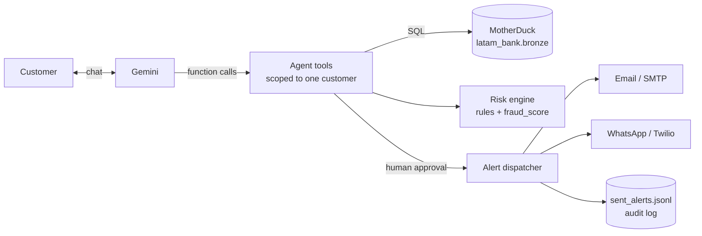
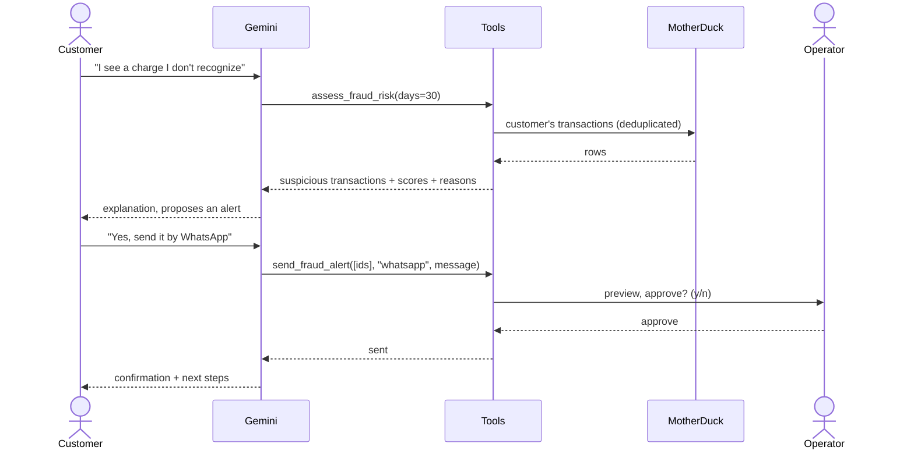

# LATAM Bank Fraud Agent

An AI agent that detects suspicious card transactions and alerts customers by email or WhatsApp.
Built for the **Factored AI & Data Hackathon 2026** on top of the synthetic LATAM Bank dataset.

- **Data:** MotherDuck (`latam_bank` database, `bronze` layer)
- **LLM:** Claude (Anthropic API), local models via Ollama, or Google Gemini (tool calling)
- **Alerts:** SMTP email and WhatsApp (Twilio)

The agent talks to an authenticated customer, reviews their transactions, explains why a
transaction looks risky, and, with the customer's agreement and a human operator's approval,
sends an alert.

---

## Table of contents

1. [Architecture](#architecture)
2. [How risk is scored](#how-risk-is-scored)
3. [Agent tools](#agent-tools)
4. [Safety controls](#safety-controls)
5. [Verified WhatsApp flow](#verified-whatsapp-flow-fraud_flowpy)
6. [Setup](#setup)
7. [Configuration reference](#configuration-reference)
8. [Usage](#usage)
9. [Setting up real alerts](#setting-up-real-alerts)
10. [Evaluation](#evaluation)
11. [Audit log](#audit-log)
12. [Column mapping](#column-mapping)
13. [Limitations](#limitations)
14. [Project structure](#project-structure)
15. [Troubleshooting](#troubleshooting)

---

## Architecture



Key design choice: **Gemini never decides the risk.** The score is computed by deterministic,
explainable code. Gemini only chooses which tool to call and explains the results to the
customer in their language.

### Typical conversation



---

## How risk is scored

Each transaction is compared **only against the customer's earlier history**, so the engine
never "looks into the future".

| # | Rule | Points | Condition |
|---|------|-------:|-----------|
| 1 | Atypical amount | +40 | `amount_usd` ≥ 3 standard deviations above the customer's mean **and** more than 2× the mean |
| 2 | New country | +30 | First transaction ever in that `transaction_country` |
| 2b | New city | +15 | First transaction in that `transaction_city` (only if the country is not new) |
| 3 | New category | +10 | New merchant category with an amount above the customer's median |
| 4 | Unusual hour | +15 | Between 00:00 and 05:00 for a customer with < 5% night-time activity |
| 5 | Burst | +25 | 3 or more transactions within 10 minutes |
| 6 | Consecutive declines | +20 | 2 or more `Declined` attempts right before (card-testing pattern) |
| 7 | Impossible travel | +35 | Two in-person transactions (ATM, Branch, POS) ≥ 300 km apart at a speed above 900 km/h |

Rules 1 to 4 need at least 5 prior transactions. Rules 4 to 6 only run when timestamps
include a time of day. Rule 7 uses `latitude` / `longitude` and skips digital channels
(Web, App, Transfer), where coordinates do not prove the card's location.

Amounts are compared in **USD** (`amount_usd`), so customers who transact in several currencies
(MXN, COP, ARS, USD) are scored consistently. Alerts still show the local amount and currency.

**Final score** = `max(rule score, bank fraud_score)`, on a 0 to 100 scale.
`fraud_score` is normalized automatically (values in 0-1 are multiplied by 100).

| Score | Level |
|------:|-------|
| ≥ 60 | high |
| 30 to 59 | medium (suspicious) |
| < 30 | low |

> `is_fraud` is **never** used to score. It is the ground-truth label and is reserved for
> [evaluation](#evaluation). Using it as a signal would be data leakage.

All thresholds and weights are constants at the top of `fraud_agent.py`
(`SUSPICIOUS_THRESHOLD`, `HIGH_RISK_THRESHOLD`, `MIN_HISTORY`, `BURST_WINDOW_MIN`, `AMOUNT_ZSCORE`).

---

## Agent tools

Gemini can call these four functions. None of them takes a customer ID: they are bound to the
customer of the session when the chat starts.

| Tool | Purpose | Returns |
|------|---------|---------|
| `view_customer_profile()` | Basic profile | Name, country, segment, status, **masked** email and phone |
| `list_transactions(days, limit)` | Recent activity | Newest-first transactions, without risk data |
| `assess_fraud_risk(days)` | Risk assessment | Suspicious transactions with score, level, reasons and card (e.g. `Credit Card ****1234`) |
| `send_fraud_alert(transaction_ids, channel, message)` | Alert the customer | Delivery result per channel |

`days` is counted back from the customer's **last recorded transaction**, not from today,
because the dataset is historical (it ends in June 2026).

The default window is **180 days**. The dataset has ~5M transactions for 150k customers over
3 years, about 33 per customer (one or two a month), so a 30-day window usually holds a single
transaction and gives the rules nothing to compare.

### Language model: Claude, local (Ollama) or Gemini

`LLM_PROVIDER` chooses the model behind the agent. Everything else (tools, OTP gate, routing,
tables) is identical, because both providers expose the same small interface
(`create_llm_session` in `fraud_agent.py`).

| | `anthropic` (default) | `ollama` | `gemini` |
|---|---|---|---|
| Runs | Claude API | On your machine | Google API |
| Quota / cost | Pay per use (API credits) | None | Free tier: ~20 requests per day per model; paid beyond |
| Internet | Required | Not needed for the model | Required |
| Quality | Highest | Good with 4B models; slower on CPU | High |
| Data | Sent to Anthropic | Never leaves the machine | Sent to Google |

With Claude, `AnthropicChat` runs the tool-use loop of the Messages API: while the response's
`stop_reason` is `tool_use`, each requested tool runs and its `tool_result` goes back to the model.
Overload (529) is retried and then falls back along `ANTHROPIC_FALLBACK_MODELS`.

With Ollama, the tool-calling loop is implemented in `OllamaChat`: tool schemas are generated
from each function's type hints and docstring, arguments are coerced (small models often send
`"30"` for an integer), reasoning is off by default (`OLLAMA_THINK=0`) for speed, and models
without reasoning support are retried automatically. `OLLAMA_FALLBACK_MODELS` works like the
Gemini fallback chain; a missing model (404) prints the `ollama pull` command to fix it.

Setup: install Ollama (ollama.com/download), then `ollama pull qwen3.5:4b` and
`ollama pull gemma4:e4b`.

### Resilience

- **Retries:** overload errors from Gemini (500, 503, 504) are retried 3 times with exponential
  backoff (2, 4 and 8 seconds).
- **Quota errors are not retried:** a 429 (quota exhausted, e.g. the free tier's daily limit per
  model) switches immediately to the next model, since waiting seconds would not help.
- **Fallback chain:** `GEMINI_FALLBACK_MODELS` lists models to try in order, keeping the
  conversation history. Each model has its own free-tier quota.
- **Idempotent tools:** a retried Gemini turn re-runs its tool calls, so tools with side effects
  (verify OTP, resend OTP, escalate) never repeat or undo their effect within a session.
- **Tool-call cap:** at most 5 tool calls per customer message, and the system prompt asks the
  model to call each tool once and offer a longer window instead of widening it on its own.

---

## Safety controls

| Control | What it prevents |
|---------|------------------|
| Tools scoped to the session's customer | A prompt injection cannot make the agent read another customer's data |
| Risk computed in code, not by the LLM | Invented or inconsistent risk levels |
| `send_fraud_alert` only accepts IDs flagged by the last `assess_fraud_risk` | Alerts about arbitrary transactions |
| Human approval (`CONFIRM_SENDS=1`) | Any message leaving the system without review |
| Demo mode (`DEMO_MODE=1`) | Messages reaching the contact data in the dataset |
| Masked contact data | Exposing full emails or phone numbers to the LLM |
| Anti-phishing footer in every alert | Customers being trained to share credentials |
| Append-only audit log | Untraceable alerts |
| Deduplication by `transaction_id` | Double-counting the ~2% duplicates in the bronze layer |

---

## Verified WhatsApp flow (`fraud_flow.py`)

The end-to-end customer journey: an anomaly opens a case, the customer proves their identity
with a one-time code, and only then does the agent discuss the case and, if needed, hand it to
a human agent who speaks the customer's language.


### Commands

| Command | What it does |
|---------|--------------|
| `python fraud_flow.py --setup` | Creates `anomaly_queue`, `fraud_cases`, `otp_codes` and `escalations` in `fraud_ops` |
| `python fraud_flow.py --trigger CUSTOMER_ID` | Opens a case for one flagged customer, sends the OTP and opens the WhatsApp simulator in the console |
| `python fraud_flow.py --trigger ID1 ID2 ID3` | Batch: one case per customer flagged by the anomaly model (no console chat) |
| `python fraud_flow.py --from-file anomalies.csv` | Batch from a CSV (`customer_id`, optional `anomaly_score`) or a TXT with one ID per line |
| `python fraud_flow.py --process-queue` | Batch from the `fraud_ops.anomaly_queue` table (pending rows) |
| `python fraud_flow.py --trigger CUSTOMER_ID --tx TX1 TX2` | One customer, with specific transactions |
| `python fraud_flow.py --chat CASE_ID` | Resumes a case in the console (a new code can be requested) |
| `python fraud_flow.py --route CUSTOMER_ID --language es` | Shows the top 5 agents and why they were ranked |
| `python fraud_flow.py --whatsapp-server` | Runs the Twilio webhook for real WhatsApp conversations |

### Connecting the anomaly model

The model only needs to output **anomalous `customer_id`s**. Three ways to hand them over:

1. **Queue table (recommended):** the model inserts rows into `fraud_ops.anomaly_queue`, and
   `--process-queue` opens the cases and marks each row as processed.

   ```sql
   INSERT INTO latam_bank.fraud_ops.anomaly_queue (customer_id, detected_at, model_name, anomaly_score)
   VALUES ('CLI-G4X2AMVD62NR', now(), 'isolation_forest_v1', 0.93);
   ```

2. **File:** export a CSV with a `customer_id` column (see `anomalies.example.csv`) and run
   `--from-file`.
3. **Python:** `fraud_flow.open_cases_for_customers(["CLI-...", ...], scores={...})`.

For each customer:

| Situation | Behavior |
|-----------|----------|
| Customer does not exist | Skipped (`not_found` in the queue) |
| Customer already has a case in progress | No new case and **no second OTP** (`duplicate`) |
| Rules also find suspicious transactions | Those transactions are shown, with their reasons |
| Rules find nothing | The case is still opened (the model flagged the customer) and the top 3 transactions of the window are shown. The agent says the model noticed an unusual pattern and asks the customer to review them, without calling any single one fraud |

Every case records `source = anomaly_model` and the model's `anomaly_score`.

In demo mode every WhatsApp goes to the same test number, so after a batch, talk to a specific
case with `--chat CASE_ID`.

In VS Code the same commands are available as **Flow · ...** run configurations.

### Tables written to `latam_bank`

`fraud_flow.py` needs a MotherDuck token with **write** access. Tables are created on the first
run (or with `--setup`) in the `fraud_ops` schema, separate from the source `bronze` data.

| Table | Key columns | Purpose |
|-------|-------------|---------|
| `anomaly_queue` | `customer_id`, `detected_at`, `model_name`, `anomaly_score`, `processed_at`, `case_id`, `result` | Input from the anomaly model; rows with `processed_at` NULL are pending |
| `fraud_cases` | `case_id`, `customer_id`, `source`, `anomaly_score`, `transaction_ids`, `max_score`, `reasons`, `status`, `customer_comment` | One row per anomaly case and its lifecycle |
| `otp_codes` | `otp_id`, `case_id`, `code_hash`, `expires_at`, `attempts`, `status` | One-time codes (hashed) and verification state |
| `escalations` | `escalation_id`, `case_id`, `agent_id`, `language`, `routing_score`, `routing_reasons`, `status` | Hand-offs to human agents, with the routing explanation |

Case status: `otp_sent` → `verified` → `customer_confirmed_legit` / `customer_reported_fraud` → `escalated`.

### OTP security

| Control | Detail |
|---------|--------|
| Secure generation | 6 digits from Python's `secrets` module |
| Never stored in plain text | `code_hash = HMAC-SHA256(OTP_SECRET, otp_id + code)`; a database leak does not reveal codes |
| Expiry | 10 minutes (`OTP_TTL_MIN`) |
| Attempt limit | 3 wrong attempts lock the code |
| Resend limit | At most 3 codes per case |
| One active code | Requesting a new code invalidates the previous one (`superseded`) |
| Enforced in code | Until `verify_otp` succeeds, every data tool returns an error, whatever the LLM tries |
| Not logged | The console shows `verify_otp(******)` |
| Anti-phishing opener | The first WhatsApp message reveals no account data and states the bank never asks for passwords |

In demo mode without SMTP, the code is printed in the console (`[demo] correo simulado; código
OTP = ...`) so the flow can be tested end to end.

### Agent routing

Agents come from `bronze.service_agents` (deduplicated by `agent_id`).

**Hard filters** (an agent who fails any of them is never chosen):

| Filter | Rule |
|--------|------|
| Language | `languages` must include the language of **this conversation**. A Spanish conversation is never routed to an English-only agent |
| Status | `agent_status = 'Active'` (no Vacation, Leave or Inactive) |
| Channel | `agent_type` is not `In-Person`, since the conversation is a chat |

**Soft score** (higher is better):

| Criterion | Points |
|-----------|-------:|
| `specialty` = Fraudes | +40 |
| `native_accent` = customer's `detected_accent` | +20 |
| `country_of_origin` = customer's `country` | +15 |
| On shift now (`work_shift`: Morning 06-14, Afternoon 14-22, Night 22-06, Rotating always) | +15 |
| `agent_type` Digital or Hybrid | +10 |
| `experience_level`: Specialist / Senior / Mid-Senior / Junior | +10 / +7 / +4 / 0 |
| `avg_csat` (1-5; missing = 3.5) | × 3 |
| `total_monthly_interactions` (workload) | − value / 100 |

If no active agent speaks the language, the escalation is stored as `pending_no_agent` and the
customer is told a person will contact them.

Example (`--route CLI-G4X2AMVD62NR --language es`):

```text
  117.5  AGT-...  Luz Rojas | español | Fraudes | Digital | Rotating
        habla español; especialista en fraudes; mismo acento (colombian); mismo país (Colombia); en turno (Rotating); atiende chat (Digital)
```

### Demo recipients and channel switches

In demo mode (`DEMO_MODE=1`) nothing is sent to the dataset's contact data. Recipients are chosen
by priority:

| Priority | Source | Example |
|---------:|--------|---------|
| 1 | Command line (one customer) | `python fraud_flow.py --trigger CLI-... --email me@gmail.com --whatsapp +573001234567` |
| 2 | `demo_recipients.csv`, one row per customer | `CLI-BBYM7NYP9LUO,teammate@gmail.com,+573004445566` |
| 3 | `TEST_ALERT_EMAIL` / `TEST_ALERT_WHATSAPP` | Default for everyone else |

With a different WhatsApp number per customer, several teammates can each run a case at the same
time: the webhook matches every incoming message to the open case of that phone number. Copy
`demo_recipients.example.csv` to `demo_recipients.csv` (it is in `.gitignore`). Every number must
have joined the Twilio sandbox.

Channel switches, independent from the credentials:

| Variable | Effect |
|----------|--------|
| `EMAIL_ENABLED=0` | No email is sent (`disabled`); the OTP is still shown in the console |
| `WHATSAPP_ENABLED=0` | No WhatsApp is sent; use the console simulator |
| `SHOW_OTP_IN_CONSOLE=0` | Hide the OTP in the console even in demo mode (it is never shown in real mode) |

At startup both scripts print the delivery status, for example:
`Modo DEMO | correo: activo | WhatsApp: desactivado | 2 destinos por cliente en demo_recipients.csv`.

In VS Code, **Flow · demo: open case with my email/WhatsApp** asks for the customer, email and
phone number.

### WhatsApp templates (Twilio error 21654)

Some Twilio WhatsApp senders (for example the trial sender assigned by the new Console) only accept
**approved Content Templates** for business-initiated messages and reject free text with error
21654. In that case the case opener must be sent as a template:

1. In the Twilio Console, open the **Content Template Builder**, create a text template and submit
   it for WhatsApp approval, or use a pre-approved sample if your sender offers one. Example body:
   `Hola {{1}}, te escribe LATAM Bank. Detectamos actividad inusual. Escribe aquí el código de 6 dígitos que enviamos a {{2}}.`
2. Copy its SID (starts with `HX`) and map the slots in `.env`:

   ```
   TWILIO_CONTENT_SID=HXxxxxxxxxxxxxxxxxxxxxxxxxxxxxxxxx
   TWILIO_CONTENT_VARIABLES={"1": "{first_name}", "2": "{email}"}
   ```

   Available fields: `first_name`, `email` (masked), `case_id`, `bank`.
3. Check it with **Flow · test WhatsApp (Twilio)** (`python fraud_flow.py --test-whatsapp +57...`),
   which sends a test opener and prints Twilio's exact answer without touching the database.

Only the opener uses the template. Replies inside the conversation are free text, which WhatsApp
allows during the 24-hour window that starts when the customer writes.

### Real WhatsApp (Twilio webhook)

The console simulator is enough for the demo. To use a real phone:

1. Configure the Twilio WhatsApp Sandbox (see [Setting up real alerts](#setting-up-real-alerts))
   and join it from your phone.
2. Start the webhook: `python fraud_flow.py --whatsapp-server` (port 8080).
3. Expose it with a tunnel, for example `ngrok http 8080`.
4. In the Twilio sandbox settings, set **When a message comes in** to
   `https://<your-ngrok-domain>/whatsapp` (method POST).
5. Set `PUBLIC_URL=https://<your-ngrok-domain>` in `.env` so the server validates Twilio's
   request signature and rejects forged requests.
6. Open a case with `--trigger <customer> --no-chat`. The OTP arrives by email and the opener by
   WhatsApp; reply from your phone.

The server answers Twilio immediately and sends the reply through the REST API, because a Gemini
turn with tools can exceed Twilio's 15-second webhook timeout. Incoming messages are matched to
the most recent open case of that phone number.

---

## Setup

### Requirements

- Python 3.10+
- A MotherDuck account with the `latam_bank` database loaded
- A Gemini API key ([Google AI Studio](https://aistudio.google.com/))
- Optional: Gmail account and/or Twilio account for real alerts

### Install

```bash
git clone <repo-url>
cd <repo>/src/agente-motherduck

python -m venv .venv
# Windows
.venv\Scripts\python -m pip install -r requirements.txt
# Linux / macOS
.venv/bin/pip install -r requirements.txt
```

### Configure

```bash
cp .env.example .env      # Windows: copy .env.example .env
```

Fill in at least `MOTHERDUCK_TOKEN` and `GEMINI_API_KEY`. The script loads `.env`
automatically, both from VS Code and from the terminal.

### First run

```bash
python fraud_agent.py --columns          # check the column mapping
python fraud_agent.py --demo-customers   # pick customers for the demo
python fraud_agent.py --customer <ID>    # start the chat
```

---

## Configuration reference

| Variable | Required | Default | Description |
|----------|:--------:|---------|-------------|
| `MOTHERDUCK_TOKEN` | yes | | MotherDuck access token (a read-only token is recommended) |
| `MOTHERDUCK_DB` | | `latam_bank` | Database name |
| `TRANSACTIONS_TABLE` | | `bronze.transactions` | Transactions table |
| `CUSTOMERS_TABLE` | | `bronze.customers` | Customers table |
| `PRODUCTS_TABLE` | | `bronze.products` | Products table (card type and last 4 digits for alerts) |
| `LLM_PROVIDER` | | `anthropic` | `anthropic` (Claude), `ollama` (local models) or `gemini` |
| `ANTHROPIC_API_KEY` | anthropic | | Claude API key |
| `ANTHROPIC_MODEL` | | `claude-sonnet-5-5` | Claude model |
| `ANTHROPIC_FALLBACK_MODELS` | | `claude-haiku-4-5-20251001` | Comma-separated fallback chain |
| `OLLAMA_MODEL` | | `qwen3.5:4b` | Local model (must support tools) |
| `OLLAMA_FALLBACK_MODELS` | | `gemma4:e4b` | Comma-separated local fallback chain |
| `OLLAMA_NUM_CTX` / `OLLAMA_NUM_PREDICT` | | `8192` / `1024` | Context window and max tokens per answer |
| `OLLAMA_THINK` | | `0` | `1` enables reasoning (better, slower) |
| `GEMINI_API_KEY` | gemini | | Gemini API key (only with `LLM_PROVIDER=gemini`) |
| `GEMINI_MODEL` | | `gemini-3.8-flash` | Primary model |
| `GEMINI_FALLBACK_MODELS` | | `gemini-3.5-flash` | Comma-separated fallback chain, used if the primary model is overloaded or out of quota |
| `DEMO_MODE` | | `1` | `1`: alerts go only to the test recipients. `0`: to the customer's real contacts |
| `CONFIRM_SENDS` | | `1` | `1`: a human must approve each alert in the console |
| `EMAIL_ENABLED`, `WHATSAPP_ENABLED` | | `1` | Turn a delivery channel on or off |
| `DEMO_RECIPIENTS_FILE` | | `demo_recipients.csv` | Optional CSV with a demo recipient per customer |
| `SHOW_OTP_IN_CONSOLE` | | `1` | Print the OTP in the console (demo mode only) |
| `TEST_ALERT_EMAIL` | | | Email recipient in demo mode |
| `TEST_ALERT_WHATSAPP` | | | WhatsApp recipient in demo mode, E.164 format (`+57...`) |
| `SMTP_HOST`, `SMTP_PORT` | | `587` | SMTP server |
| `SMTP_USER`, `SMTP_PASSWORD` | | | SMTP credentials (for Gmail, an App Password) |
| `SMTP_FROM` | | `SMTP_USER` | Sender address |
| `TWILIO_ACCOUNT_SID`, `TWILIO_AUTH_TOKEN` | | | Twilio credentials |
| `TWILIO_WHATSAPP_FROM` | | | Twilio WhatsApp sender (the sandbox number while testing) |
| `TWILIO_CONTENT_SID` | | | Approved Content Template (HX...) for the case opener; needed if Twilio answers 21654 |
| `TWILIO_CONTENT_VARIABLES` | | | JSON mapping template slots to fields, e.g. `{"1": "{first_name}", "2": "{email}"}` |
| `OTP_SECRET` | flow | | Server-side secret for hashing OTPs. Use a long random string and never commit it |
| `OTP_TTL_MIN` | | `10` | Minutes an OTP stays valid |
| `FRAUD_OPS_SCHEMA` | | `fraud_ops` | Schema in `latam_bank` for cases, OTPs and escalations |
| `AGENTS_TABLE` | | `bronze.service_agents` | Service agents table used for routing |
| `PUBLIC_URL` | | | Public HTTPS URL of the webhook (ngrok); enables Twilio signature validation |
| `WHATSAPP_SERVER_PORT` | | `8080` | Port of the WhatsApp webhook |

If the email or WhatsApp settings are missing, alerts are **simulated**: everything runs and is
logged, but nothing is delivered. That is enough for a demo.

---

## Usage

### Command line

| Command | What it does |
|---------|--------------|
| `python fraud_agent.py --customer CUST-000123` | Interactive chat for that customer |
| `python fraud_agent.py --monitor ID1 ID2 ...` | Proactive scan; proposes alerts for high-risk transactions (no LLM) |
| `python fraud_agent.py --demo-customers` | Top customers by fraud signals in the dataset's last 30 days |
| `python fraud_agent.py --evaluate 40` | Precision and recall on a sample of 40 customers |
| `python fraud_agent.py --columns` | Shows how table columns were mapped |

Options: `--days N` (analysis window, default 180) and `--channel email|whatsapp|both`
(for `--monitor`, default `both`).

### VS Code

Open the folder in VS Code and use **Run and Debug** (`Ctrl+Shift+D`):

- **Fraud · chat with customer** (asks for the customer ID)
- **Fraud · demo customers**
- **Fraud · monitor customer** (asks for the customer ID)
- **Fraud · evaluate rules**
- **Fraud · show columns**

### Example session

```text
Cliente: Hola, vi un cobro raro en mi tarjeta
  [tool] assess_fraud_risk(days=30)

Agente: Revisé tus últimos 30 días y encontré 3 transacciones de riesgo alto el 4 de marzo,
entre las 3:00 y las 3:03 a.m., en Miami: dos intentos rechazados de 900 USD y un cobro
aprobado de 950 USD. Es 12 veces tu gasto promedio, en un país donde nunca habías comprado y
a una hora inusual para ti. ¿Quieres que te envíe una alerta por WhatsApp con el detalle?
```

---

## Setting up real alerts

Keep `DEMO_MODE=1` while testing: alerts will only reach `TEST_ALERT_EMAIL` and
`TEST_ALERT_WHATSAPP`.

### Email (Gmail)

1. Turn on 2-Step Verification in your Google account.
2. Create an **App Password** (Google Account → Security → App passwords).
3. Put the 16-character password in `SMTP_PASSWORD` (not your normal password).

### WhatsApp (Twilio Sandbox)

1. Create a free Twilio account.
2. Go to **Messaging → Try it out → Send a WhatsApp message**.
3. From your phone, send the `join <code>` message shown in the console to the sandbox number.
4. Copy the Account SID, Auth Token and sandbox number into `.env`.

The sandbox only delivers to phones that joined it, which also makes it safe for demos.

---

## Evaluation

```bash
python fraud_agent.py --evaluate 40
```

1. Draws a **balanced sample**: half customers with at least one `is_fraud` transaction, half without.
2. Scores **every** transaction of those customers against their own prior history.
3. Reports precision and recall against `is_fraud` for three signals at two thresholds (30 and 60):
   - `rules`: the explainable rules alone
   - `model`: the bank's `fraud_score` alone
   - `combined`: the final score used by the agent

```text
signal       threshold  alerts  precision   recall
rules               30     ...        ...      ...
model               30     ...        ...      ...
combined            30     ...        ...      ...
```

Because the sample over-represents fraud, **real-world precision will be lower** than reported.
Recall is not affected by the balancing.

---

## Audit log

Every alert attempt (sent, simulated or failed) is appended to `sent_alerts.jsonl`:

```json
{"timestamp": "2026-10-04T10:15:02", "source": "agent", "customer_id": "CUST-000123",
 "demo_mode": true, "transactions": ["TX63"], "scores": [100],
 "results": {"whatsapp": "sent"}}
```

`source` is `agent` (chat) or `monitor` (proactive scan). The file is in `.gitignore`.

---

## Column mapping

The defaults match the **LATAM Bank Complete Data Dictionary** (v1.0.0):

| Table | Columns used |
|-------|--------------|
| `transactions` | `transaction_id`, `customer_id`, `product_id`, `transaction_date`, `amount`, `amount_usd`, `currency`, `merchant_name`, `merchant_category`, `transaction_country`, `transaction_city`, `channel`, `transaction_type`, `transaction_status`, `response_code`, `fraud_score`, `is_fraud`, `latitude`, `longitude` |
| `customers` | `customer_id`, `first_name`, `last_name`, `email`, `mobile_phone`, `country`, `segment`, `customer_status`, `last_updated` |
| `products` | `product_id`, `product_type`, `product_number` (last 4 digits only), `product_status`, `last_updated` |

Even so, column names are not hard-coded. For each logical field, `fraud_agent.py` tries a list of
candidate names and uses the first one that exists (`TX_COLUMN_CANDIDATES` and
`CUSTOMER_COLUMN_CANDIDATES`).

- **Required:** transaction id, customer id, timestamp, amount. The script stops with a clear
  message if any is missing.
- **Optional:** currency, product, merchant, category, city, country, channel, type, status,
  response code, `fraud_score`, `is_fraud`. Rules that need a missing field are skipped.

If `--columns` shows a field as "no encontrada" but the column exists under another name,
add that name at the **start** of the corresponding candidate list.

---

## Limitations

- **Rule-based scoring.** The rules are a transparent baseline, not a trained model. Weights were
  chosen by hand and should be tuned with `--evaluate`.
- **Historical data.** Windows are relative to each customer's last transaction, so the agent
  behaves as if "now" were that moment.
- **Missing USD amounts.** `amount_usd` is nullable (~5% nulls in the dataset); those transactions
  are skipped by the amount rule. `daily_exchange_rates` could be used to fill them.
- **No card blocking.** The agent recommends blocking the card and escalating, but cannot execute
  the block itself.
- **Portuguese.** Gemini replies in Portuguese, but alert templates and rule reasons are in Spanish,
  and the dataset has no Portuguese conversations to test with.
- **Compute budget.** `--demo-customers` and `--evaluate` scan the full transactions table. On the
  MotherDuck Lite plan, run them sparingly.
- **Data privacy.** Transaction data sent to Gemini leaves the bank's environment. The free tier
  of the Gemini API may use content to improve Google's products.

---

## Project structure

```text
agente-motherduck/
├── fraud_agent.py       # Risk engine, data access, alert delivery, customer chat
├── fraud_flow.py        # OTP-verified WhatsApp flow and agent routing
├── anomalies.example.csv # Example input from the anomaly model
├── demo_recipients.example.csv # Demo recipient per customer (copy to demo_recipients.csv)
├── motherduck_ia.py     # General natural-language SQL assistant (Ollama, Gemini, MotherDuck AI)
├── requirements.txt     # duckdb, ollama, google-genai
├── .env.example         # Configuration template (copy to .env)
├── .gitignore           # Excludes .env, .venv, logs
├── README.md
└── .vscode/
    ├── launch.json      # Run configurations
    └── settings.json
```

`motherduck_ia.py` is an exploratory tool for asking free-form questions about any table, with
local models (Ollama), Gemini or MotherDuck's built-in AI. Run `python motherduck_ia.py --help`.

---

## Troubleshooting

| Symptom | Cause and fix |
|---------|---------------|
| `Falta MOTHERDUCK_TOKEN` / `Falta GEMINI_API_KEY` | `.env` missing or misnamed; it must be called exactly `.env` |
| `No encontré la tabla bronze.transactions` | Wrong `MOTHERDUCK_DB` or `TRANSACTIONS_TABLE` |
| `Faltan columnas obligatorias` | Add the real column names to `TX_COLUMN_CANDIDATES` |
| `ModuleNotFoundError: No module named 'google'` | VS Code is using another interpreter: select `.venv` with *Python: Select Interpreter* |
| Gemini model error | Set `GEMINI_MODEL` to another available model (the error message suggests one) |
| Alerts say `simulated` | SMTP/Twilio settings or `TEST_ALERT_*` recipients are missing |
| Email `error: ... Username and Password not accepted` | Use a Gmail App Password, not your normal password |
| WhatsApp error 63015 or similar | Your phone has not joined the Twilio sandbox yet |
| `Cannot ... read-only` / permission error on `CREATE SCHEMA` | `fraud_flow.py` writes to `latam_bank`: use a Read/Write MotherDuck token |
| OTP always "Wrong code" after restarting | `OTP_SECRET` changed between sending and verifying; keep it fixed in `.env` |
| WhatsApp replies never arrive | Check the ngrok URL in Twilio, that it ends in `/whatsapp`, and that `PUBLIC_URL` matches it exactly |
| Gemini `429 RESOURCE_EXHAUSTED` | Free-tier quota used up (e.g. 20 requests per day per model). Enable billing in Google AI Studio, or add models to `GEMINI_FALLBACK_MODELS` |
| `No hay conexión con Ollama` | Open the Ollama app (or `ollama serve`) and check `OLLAMA_HOST` |
| `modelo no disponible (404)` with Ollama | Run the `ollama pull <model>` command shown in the console |
