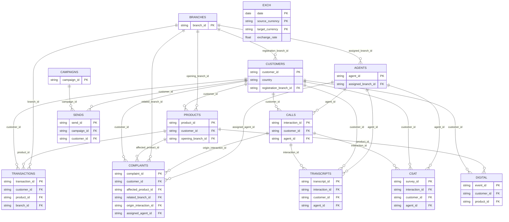

```mermaid
erDiagram

    %% =========================
    %% Dimensions
    %% =========================

    CUSTOMERS {
        string customer_id PK
        string country
        string registration_branch_id FK
    }

    PRODUCTS {
        string product_id PK
        string customer_id FK
        string opening_branch_id FK
    }

    BRANCHES {
        string branch_id PK
    }

    AGENTS {
        string agent_id PK
        string assigned_branch_id FK
    }

    CAMPAIGNS {
        string campaign_id PK
    }

    EXCH {
        date date PK
        string source_currency PK
        string target_currency PK
        float exchange_rate
    }

    %% =========================
    %% Facts
    %% =========================

    TRANSACTIONS {
        string transaction_id PK
        string customer_id FK
        string product_id FK
        string branch_id FK
    }

    CALLS {
        string interaction_id PK
        string customer_id FK
        string agent_id FK
    }

    TRANSCRIPTS {
        string transcript_id PK
        string interaction_id FK
        string customer_id FK
        string agent_id FK
    }

    CSAT {
        string survey_id PK
        string interaction_id FK
        string customer_id FK
        string agent_id FK
    }

    DIGITAL {
        string event_id PK
        string customer_id FK
        string product_id FK
    }

    COMPLAINTS {
        string complaint_id PK
        string customer_id FK
        string affected_product_id FK
        string related_branch_id FK
        string origin_interaction_id FK
        string assigned_agent_id FK
    }

    SENDS {
        string send_id PK
        string campaign_id FK
        string customer_id FK
    }

    %% =========================
    %% Relationships
    %% =========================

    CUSTOMERS ||--o{ TRANSACTIONS : "customer_id"
    PRODUCTS ||--o{ TRANSACTIONS : "product_id"
    BRANCHES ||--o{ TRANSACTIONS : "branch_id"

    CUSTOMERS ||--o{ CALLS : "customer_id"
    AGENTS ||--o{ CALLS : "agent_id"

    CALLS ||--o{ TRANSCRIPTS : "interaction_id"
    CUSTOMERS ||--o{ TRANSCRIPTS : "customer_id"
    AGENTS ||--o{ TRANSCRIPTS : "agent_id"

    CALLS ||--o{ CSAT : "interaction_id"
    CUSTOMERS ||--o{ CSAT : "customer_id"
    AGENTS ||--o{ CSAT : "agent_id"

    CUSTOMERS ||--o{ DIGITAL : "customer_id"
    PRODUCTS ||--o{ DIGITAL : "product_id"

    CUSTOMERS ||--o{ COMPLAINTS : "customer_id"
    PRODUCTS ||--o{ COMPLAINTS : "affected_product_id"
    BRANCHES ||--o{ COMPLAINTS : "related_branch_id"
    CALLS ||--o{ COMPLAINTS : "origin_interaction_id"
    AGENTS ||--o{ COMPLAINTS : "assigned_agent_id"

    CAMPAIGNS ||--o{ SENDS : "campaign_id"
    CUSTOMERS ||--o{ SENDS : "customer_id"

    %% =========================
    %% Dimension cross-links
    %% =========================

    BRANCHES ||--o{ CUSTOMERS : "registration_branch_id"
    CUSTOMERS ||--o{ PRODUCTS : "customer_id"
    BRANCHES ||--o{ PRODUCTS : "opening_branch_id"
    BRANCHES ||--o{ AGENTS : "assigned_branch_id"

    %% EXCH no tiene FK explícita hacia las tablas de hechos
```